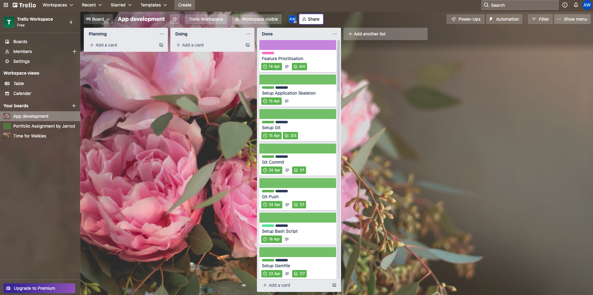
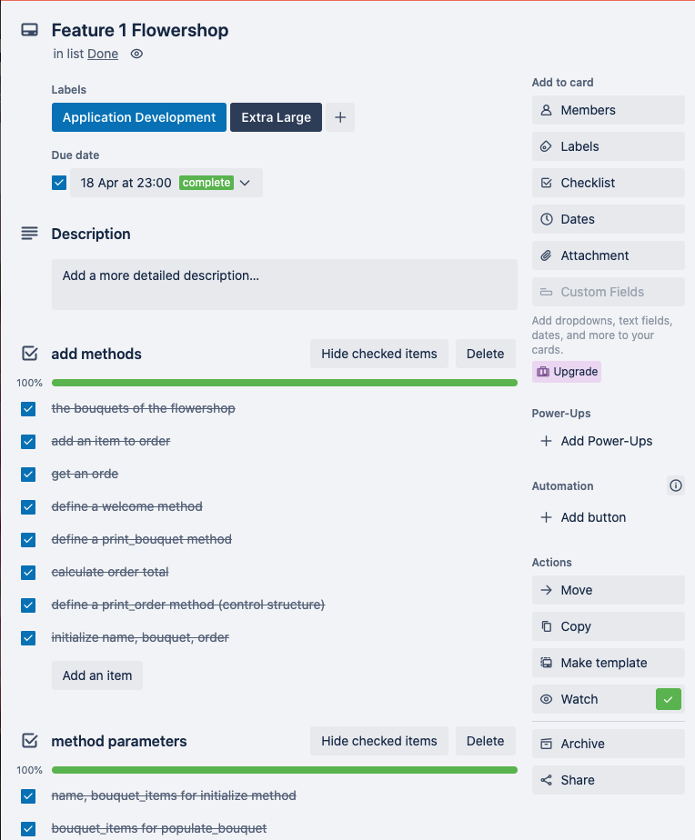
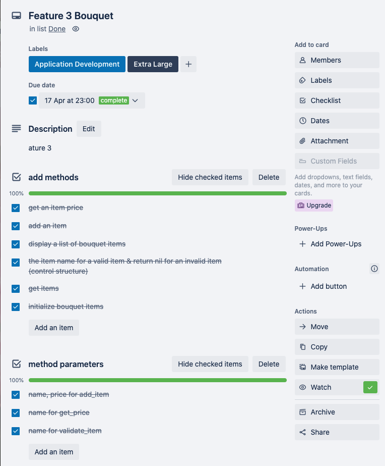
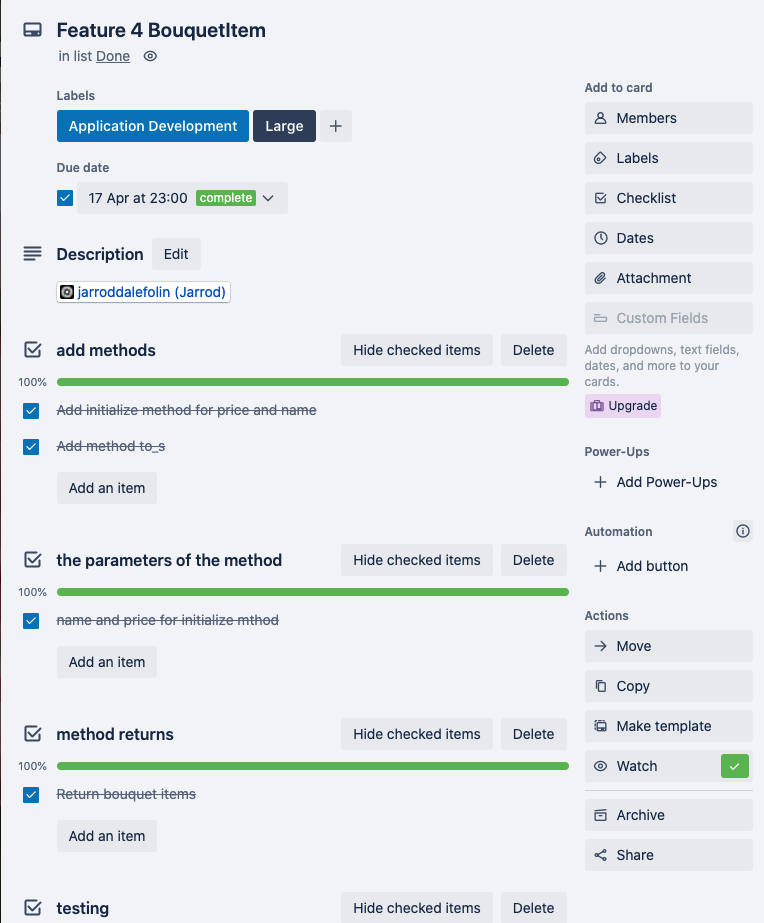
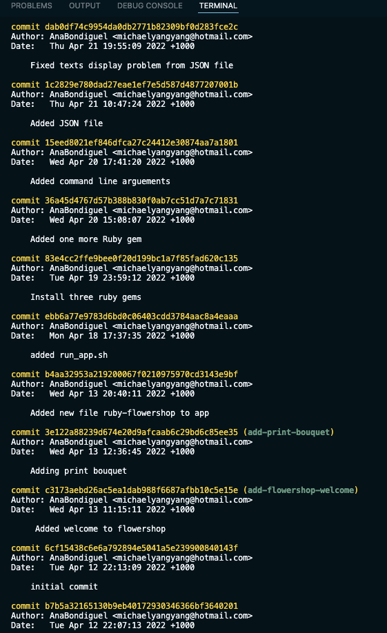

# Ruby flower shop application

This is a flower shop "Blosson House" appplication written by Ruby.

# R3 Full attribution to referenced sources
[TTY Component](https://ttytoolkit.org/components/)
[Rubocop](https://github.com/rubocop/rubocop)
[Colorize](https://github.com/fazibear/colorize)
[TTY-prompt](https://github.com/piotrmurach/tty-prompt)
[pastel](https://github.com/piotrmurach/pastel)
[TTY-font](https://github.com/piotrmurach/tty-font)
[JSON](https://ruby-doc.org/stdlib-2.6.3/libdoc/json/rdoc/JSON.html?ref=hackernoon.com)
[JSON-File](https://hackernoon.com/ruby-how-to-readwrite-json-file-a23h3vxa)
[Rspec](https://github.com/rspec/rspec-metagem/)
[RubyGems](https://rubygems.org/)
[Jarrod-examples](https://replit.com/@jarroddalefolin)
[RuboCopDocs](https://docs.rubocop.org/rubocop/index.html)
[RubyStyleGuide](https://rubystyle.guide/)
[Rspec](https://rubygems.org/gems/respec)

# R4 A link of my source control repository
[MyGitHub](https://github.com/AnaBondiguel/ruby-flowershop-app.git)

# R5 Identify any code style guide or styling conventions that the application will adhere to
My application followed the Ruby Style Guide (RubyStyleGuide, 2022) that recommends best practices for real-world Ruby programmers who can write code that can be maintained by other real-world Ruby programmers.The guidelines intended to improve the readability of code and make it consistent across the wide spectrum of Ruby code.  [RubyStyleGuide](https://rubystyle.guide/)

I used "RuboCop" to guide code style. RuboCop is a Ruby static code analyzer and code formatter. It is not only reporting problems that are discovered in my code but also automatically fix many of them for me. Out of the box "RuboCop" will enforce many of the guidelines outlined in the community Ruby Style Guide (Rubocop, 2022; RuboCopDocs, 2022). [Rubocop](https://github.com/rubocop/rubocop) [RuboCopDocs](https://docs.rubocop.org/rubocop/index.html)

RuboCop - Flower shop application

#	R6 Develop a list of features that are included in the application. 
## Four Features: 
Display Welcome, Display Bouquets, Placing An Order, and Display Order and Total Order Price

These features allow me to demonstrate my understanding of use of variables and the concept of variable scope, loops and conditional control structures, and error handling.

## Describe Each Feature:

### Display Welcome:
Welcome message displays flower shop name

### Display Bouquets:	
Bouquets displays bouquet items

### Placing An Order:
 1. Validate item using bouquets
 2. Add item to order

### Displays Order and Total Order Price:
 1. Display order items from order
 2. Display order cost using prices from bouquets and items in order

# R7 Develop an implementation plan
## Outlines how each feature will be implemented and a checklist of tasks for each feature
### Feature 1. The Flowershop class

- Attributes: name, bouquet, order

- Actions: Display welcome message, display bouquets, display order with total, and add item to order

- Checklists: 8 methods, 4 method parameters, 2 method returns, 1 control structure, 6 tests

Methods: initialize method, print_order method, order_total method, print_bouquet method, welcome method, get_order method, add_to_order method, pupolate_bouquet method

Method parameters: name and bouquet_items for initialize method, item and quantity for add_to_order method, bouquet_items for populate_bouquet method

Method returns: return order, return total

Tests: create a flowerhsop with a name, create a flowershop with a bouquet, add an item to order, define a welcome method, define a print_bouquet method, calculate order total

### Feature 2. The Order class

- Attributes: order items, item quantity

- Actions: add item, get items, display order items

- Checklists: 3 methods, 2 method parameters, 1 method return, 2 tests

Methods: initialize method, add_item method, get_item method

Method parameters: name and quantity for add_item method

Method returns: return order_items

Tests: add item to order, update item quantity

### Feature 3. The Bouquet class:

- Attributes: bouquet items, item price

- Actions: add bouquet item, display bouquet, get price for bouquet item, and validate bouquet item

- Checklists: 6 methods, 2 method parameters, 5 method returns, 1 control structure, 4 tests

Methods: initialize method, add_item method, get_price method, get_items method, display method, validate_item method

Method parameters: name and price for add_item method, name for get_price method, name for validate_item method

Method returns: return price of item, return bouquet items, return nil(display method), return name of bouquet item or nil (validate_item method)

Tests: get item price, add item, return item name for validate item, return nil for invalid item

### Feature 4. The BouquetItem class

- Attributes: item price, item name

- Actions: display name and price of items

- Checklists: 2 methods, 2 method parameters, 1 method returns, 2 tests

Methods: initialize method, to_s method

Method parameters: name and price for initialize method

Method returns: return name and price of bouquet items

Tests: return the price of the item, return the name of the item

## Prioritise the implementation of different features, or checklist items within a feature

 Building features from the lowest data structure to the highest one, and the order is: BouquetItem, Bouquet, Order, and Flowershop

1. Items in BouquetItem: initialize the price of the item & the name of the item, add method to_s

2. Items in Bouquet: initialize bouquet items, get items, get an item price, add an item, display a list of bouquet items, the item name for a valide item, & return nil for invalid item

3. Items in Order: initialize order items, add an item to the order & update an item quantity

4. Items in Flowershop: initialize the name, bouquet, and order, the bouquets of the flowershop, add an item to order, get an order,  define a welcome method, define a print_bouquet method, calculate order total, & define a print_order method.

## Provide a deadline, duration or other time indicator for each feature or checklist/checklist-item

I used Trello for my project management. I set up each feature into different size projects, such as, large and extra large. I also set up a deadline for each feature. BouquetItem, Bouquet, and Order should be done on 17 April, and Flowershop is an extra large project amd should be done on 18 April. 

Reference for my project management: [Trello](https://trello.com/b/u7TEDeFr/app-development)

### Screenshots for project management (screenshoot cannot capture the whole picture of the features, please refer to my Trello website)

# R8 Design help documentation which includes a set of instructions which accurately describe how to use and install the application.
## Steps to install the application

Step 1 Break down the problem

Step 2 Define the data structure

Step 3 Write tests

Step 4 Write the application for the flower shop

## Any dependencies required by the application to operate
I intalled rbenv 1.2.0 and ruby 2.7.1p83 (2020-03-31 revision a0c7c23c9c) [x86_64-darwin19]

gem "rspec", "~> 3.11" : using for TDD [Rspec](https://rubygems.org/gems/respec) [Rspec](https://github.com/rspec/rspec-metagem/)

gem "colorize" : colorizing app text  [Colorize](https://github.com/fazibear/colorize)

gem 'rubocop' : seting up coding style [Rubocop](https://github.com/rubocop/rubocop)

gem 'tty-prompt', '~> 0.23.1' : command line prompt with a robust API for getting and validating complex inputs [TTY-prompt](https://github.com/piotrmurach/tty-prompt)

gem 'tty-font' : writing text in large stylized characters [TTY-font](https://github.com/piotrmurach/tty-font)

gem "pastel" : terminal output styling  [pastel](https://github.com/piotrmurach/pastel)

gem'json' : storing and displaying each bouquet description  [JSON](https://ruby-doc.org/stdlib-2.6.3/libdoc/json/rdoc/JSON.html?ref=hackernoon.com) [JSON-File](https://hackernoon.com/ruby-how-to-readwrite-json-file-a23h3vxa)

## Any system/hardware requirements
 

If users have the same system as me or better, the flowershop appication will definitely work.

## How to use any command line arguments made for the application

I used the command line arguments for saying "hello" to the users with if and else statement.

if ARGV[0]

  customer_name = ARGV[0]

else

  begin

    customer_name = prompt.ask('What is your name?')
    raise InvalidNameError if customer_name.empty?

    puts '-----------------'
    puts "Hello, #{customer_name}!".colorize(:blue)
    puts ''

  rescue StandardError

    puts 'Please enter your name!'.colorize(:red)
    retry

  end

end

Also, I used the command line arguments for the delivery service of the flower shop with if and else statement.

    if ARGV[1]

        customer_address = ARGV[1]

    else

        customer_address = prompt.ask("Where would you like to be deliverd?".colorize(:blue))

        puts "Your delivery fee is $30 for #{customer_address}. We'll send your flowers to your place shortly."
        puts "--------------------------------------"
        puts "Total: $#{flowershop.order_total + 30}"
    end

# R16 Utilise source control throughout the development of the application by:
## Making regular commits (at least 20 commits) with a commit message that summarises the changes
screeshots from my git log

 
 
 

## Pushing all commits to a remote repository
I pushed my git commits to my repository every time when I made git commits with a message. Here is an example for pushing my git commits to my repository:

Please see my GitHub
[MyGitHub](https://github.com/AnaBondiguel/ruby-flowershop-app.git)